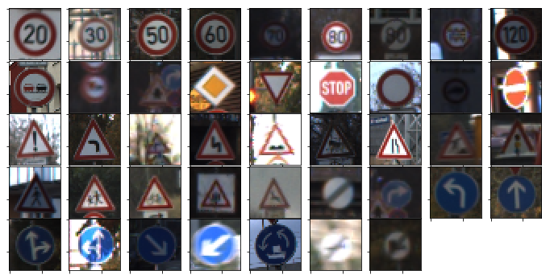
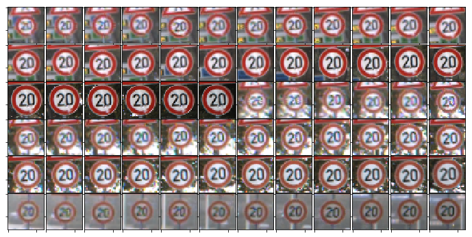
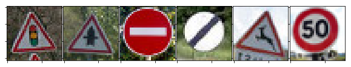

# Self-Driving Car Engineer Nanodegree

## Deep Learning

## Project: Build a Traffic Sign Recognition Classifier

In this notebook, a template is provided for you to implement your functionality in stages, which is required to successfully complete this project. If additional code is required that cannot be included in the notebook, be sure that the Python code is successfully imported and included in your submission if necessary. 

> **Note**: Once you have completed all of the code implementations, you need to finalize your work by exporting the iPython Notebook as an HTML document. Before exporting the notebook to html, all of the code cells need to have been run so that reviewers can see the final implementation and output. You can then export the notebook by using the menu above and navigating to  \n",
    "**File -> Download as -> HTML (.html)**. Include the finished document along with this notebook as your submission. 

In addition to implementing code, there is a writeup to complete. The writeup should be completed in a separate file, which can be either a markdown file or a pdf document. There is a [write up template](https://github.com/udacity/CarND-Traffic-Sign-Classifier-Project/blob/master/writeup_template.md) that can be used to guide the writing process. Completing the code template and writeup template will cover all of the [rubric points](https://review.udacity.com/#!/rubrics/481/view) for this project.

The [rubric](https://review.udacity.com/#!/rubrics/481/view) contains "Stand Out Suggestions" for enhancing the project beyond the minimum requirements. The stand out suggestions are optional. If you decide to pursue the "stand out suggestions", you can include the code in this Ipython notebook and also discuss the results in the writeup file.


>**Note:** Code and Markdown cells can be executed using the **Shift + Enter** keyboard shortcut. In addition, Markdown cells can be edited by typically double-clicking the cell to enter edit mode.

---
## Step 0: Load The Data


```python
# Load pickled data
import pickle

# TODO: Fill this in based on where you saved the training and testing data

training_file = 'data/train.p'
testing_file = 'data/test.p'

with open(training_file, mode='rb') as f:
    train = pickle.load(f)
with open(testing_file, mode='rb') as f:
    test = pickle.load(f)
    
X_train, y_train = train['features'], train['labels']
X_test, y_test = test['features'], test['labels']
```

---

## Step 1: Dataset Summary & Exploration

The pickled data is a dictionary with 4 key/value pairs:

- `'features'` is a 4D array containing raw pixel data of the traffic sign images, (num examples, width, height, channels).
- `'labels'` is a 1D array containing the label/class id of the traffic sign. The file `signnames.csv` contains id -> name mappings for each id.
- `'sizes'` is a list containing tuples, (width, height) representing the the original width and height the image.
- `'coords'` is a list containing tuples, (x1, y1, x2, y2) representing coordinates of a bounding box around the sign in the image. **THESE COORDINATES ASSUME THE ORIGINAL IMAGE. THE PICKLED DATA CONTAINS RESIZED VERSIONS (32 by 32) OF THESE IMAGES**

Complete the basic data summary below. Use python, numpy and/or pandas methods to calculate the data summary rather than hard coding the results. For example, the [pandas shape method](http://pandas.pydata.org/pandas-docs/stable/generated/pandas.DataFrame.shape.html) might be useful for calculating some of the summary results. 

### Provide a Basic Summary of the Data Set Using Python, Numpy and/or Pandas


```python
### Replace each question mark with the appropriate value. 
### Use python, pandas or numpy methods rather than hard coding the results

import numpy as np

# TODO: Number of training examples
n_train = y_train.shape[0]

# TODO: Number of testing examples.
n_test = y_test.shape[0]

# TODO: What's the shape of an traffic sign image?
image_shape = X_train.shape[1:]

# TODO: How many unique classes/labels there are in the dataset.
n_classes = np.unique(y_train).shape[0]

print("Number of training examples =", n_train)
print("Number of testing examples =", n_test)
print("Image data shape =", image_shape)
print("Number of classes =", n_classes)
```

    Number of training examples = 39209
    Number of testing examples = 12630
    Image data shape = (32, 32, 3)
    Number of classes = 43


### Include an exploratory visualization of the dataset

Visualize the German Traffic Signs Dataset using the pickled file(s). This is open ended, suggestions include: plotting traffic sign images, plotting the count of each sign, etc.

The [Matplotlib](http://matplotlib.org/) [examples](http://matplotlib.org/examples/index.html) and [gallery](http://matplotlib.org/gallery.html) pages are a great resource for doing visualizations in Python.

**NOTE:** It's recommended you start with something simple first. If you wish to do more, come back to it after you've completed the rest of the sections.

First, let's count the number of examples for each of the 43 classes.  
We see that data is very unbalanced.


```python
np.unique(y_train, return_counts=True)
```


    (array([ 0,  1,  2,  3,  4,  5,  6,  7,  8,  9, 10, 11, 12, 13, 14, 15, 16,
            17, 18, 19, 20, 21, 22, 23, 24, 25, 26, 27, 28, 29, 30, 31, 32, 33,
            34, 35, 36, 37, 38, 39, 40, 41, 42], dtype=uint8),
     array([ 210, 2220, 2250, 1410, 1980, 1860,  420, 1440, 1410, 1470, 2010,
            1320, 2100, 2160,  780,  630,  420, 1110, 1200,  210,  360,  330,
             390,  510,  270, 1500,  600,  240,  540,  270,  450,  780,  240,
             689,  420, 1200,  390,  210, 2070,  300,  360,  240,  240]))


Then, let's visualize one random example for each class


```python
### Data exploration visualization goes here.
### Feel free to use as many code cells as needed.
import matplotlib.pyplot as plt
# Visualizations will be shown in the notebook.
%matplotlib inline

# Number of examples in each class (train and test sets)
np.unique(y_train, return_counts=True)

# Random example of each class
import matplotlib.gridspec as gridspec

plt.figure(figsize = (12, 6))
gs1 = gridspec.GridSpec(5, 9)
gs1.update(wspace=0.025, hspace=0.025) 

for i, c in enumerate(np.unique(y_train)):
    sample_index = np.random.choice(np.where(y_train == c)[0], 1)[0]
    ax1 = plt.subplot(gs1[i])
    plt.axis('on')
    ax1.set_xticklabels([])
    ax1.set_yticklabels([])
    ax1.set_aspect('equal')
    plt.imshow(X_train[sample_index])

plt.show()
```





We must note that input data is highly correlated:


```python
import matplotlib.pyplot as plt
import matplotlib.gridspec as gridspec
%matplotlib inline

start_image = 0
n_row = 6
n_col = 12

plt.figure(figsize = (n_col,n_row))
gs1 = gridspec.GridSpec(n_row, n_col)
gs1.update(wspace=0.025, hspace=0.025) 

for i in range(n_col*n_row):
    ax1 = plt.subplot(gs1[i])
    plt.axis('on')
    ax1.set_xticklabels([])
    ax1.set_yticklabels([])
    ax1.set_aspect('equal')
    plt.imshow(X_train[start_image+i])

plt.show()
```





----

## Step 2: Design and Test a Model Architecture

Design and implement a deep learning model that learns to recognize traffic signs. Train and test your model on the [German Traffic Sign Dataset](http://benchmark.ini.rub.de/?section=gtsrb&subsection=dataset).

There are various aspects to consider when thinking about this problem:

- Neural network architecture
- Play around preprocessing techniques (normalization, rgb to grayscale, etc)
- Number of examples per label (some have more than others).
- Generate fake data.

Here is an example of a [published baseline model on this problem](http://yann.lecun.com/exdb/publis/pdf/sermanet-ijcnn-11.pdf). It's not required to be familiar with the approach used in the paper but, it's good practice to try to read papers like these.

**NOTE:** The LeNet-5 implementation shown in the [classroom](https://classroom.udacity.com/nanodegrees/nd013/parts/fbf77062-5703-404e-b60c-95b78b2f3f9e/modules/6df7ae49-c61c-4bb2-a23e-6527e69209ec/lessons/601ae704-1035-4287-8b11-e2c2716217ad/concepts/d4aca031-508f-4e0b-b493-e7b706120f81) at the end of the CNN lesson is a solid starting point. You'll have to change the number of classes and possibly the preprocessing, but aside from that it's plug and play!

### Pre-process the Data Set (normalization, grayscale, etc.)

Use the code cell (or multiple code cells, if necessary) to implement the first step of your project.


```python
### Preprocess the data here. Preprocessing steps could include normalization, converting to grayscale, etc.
### Feel free to use as many code cells as needed.
```

##### Data augmentation

New training images are created using scaling, rotation and pixel shifting.  
This technique has two advantages:
- fix the unbalanced training dataset problem
- allows the model to learn better


```python
from PIL import Image

def shift(t, x, y):
    a = t.copy()
    if x > 0:
        a[x:, :, :] = a[:-x, :, :]
        a[:x, :, :] = 0
    elif x < 0:
        a[:x, :, :] = a[-x:, :, :]
        a[x:, :, :] = 0
    if y > 0:
        a[:, y:, :] = a[:, :-y, :]
        a[:, :y, :] = 0
    elif y < 0:
        a[:, :y, :] = a[:, -y:, :]
        a[:, y:, :] = 0
    return a

def rotate(t, a):
    return np.array(Image.fromarray(t).rotate(a, expand=False)).copy()

def scale(t, f):
    a = t.copy()
    new_size = int(f*32)
    if new_size != 32:
        size = new_size, new_size
        im = Image.fromarray(a).resize(size)
        a = np.array(im)
        if new_size > 32:
            a = a[int(a.shape[0]/2)-16:int(a.shape[0]/2)+16, int(a.shape[0]/2)-16:int(a.shape[0]/2)+16, :]
        else:
            temp = np.zeros((32, 32, 3))
            decay = int((32-a.shape[0])/2)
            temp[decay:decay+a.shape[0],decay:decay+a.shape[0],:] = a
            a = temp
    return a
```

##### Dataset rebalancing (using augmentated data)

Rebalancing the data prevent the model from being biaised towards classes that are more present in the training set. 


```python
n_classes = np.unique(y_train).shape[0]
n_examples_per_class = 5000

for c in np.unique(y_train):
    indexes = np.where(y_train == c)[0]
    n_new_examples = n_examples_per_class-indexes.shape[0]
    if n_new_examples > 0:
        new_samples_indexes = np.random.choice(indexes, n_new_examples, replace=True)
        X_train_new = X_train[new_samples_indexes]
        y_train_new = y_train[new_samples_indexes]
        for i in range(n_new_examples):
            x_shift = np.random.randint(low=-2, high=+2)
            y_shift = np.random.randint(low=-2, high=+2)
            rotation_angle = np.random.randint(low=-10, high=+10)
            scale_factor = np.random.uniform(low=.9, high=1.1)
            X_train_new[i,:,:,:] = scale(X_train_new[i,:,:,:], scale_factor)
            X_train_new[i,:,:,:] = rotate(X_train_new[i,:,:,:], rotation_angle)
            X_train_new[i,:,:,:] = shift(X_train_new[i,:,:,:], x_shift, y_shift)
        X_train = np.append(X_train, X_train_new, axis=0)
        y_train = np.append(y_train, y_train_new, axis=0)
```

##### Preprocessing

Convert images to grayscale.  
This has the advantage to reduce the dimension and allows the model to be more invariant to changing lighting conditions.


```python
r = 0.299
g = 0.587
b = 0.114
X_train = X_train[:,:,:,0]*r + X_train[:,:,:,1]*g + X_train[:,:,:,2]*b
X_test = X_test[:,:,:,0]*r + X_test[:,:,:,1]*g + X_test[:,:,:,2]*b
X_train = X_train.reshape((X_train.shape[0], X_train.shape[1], X_train.shape[2], 1))
X_test = X_test.reshape((X_test.shape[0], X_test.shape[1], X_test.shape[2], 1))
```

Local normalisation (image by image).  
It makes the model learn faster.


```python
for i in range(X_train.shape[0]):
    X_train[i] -= X_train[i].mean()
    X_train[i] /= X_train[i].std()
for i in range(X_test.shape[0]):
    X_test[i] -= X_test[i].mean()
    X_test[i] /= X_test[i].std()
```

### Split Data into Training, Validation and Testing Sets


```python
### Split the data into training/validation/testing sets here.
### Feel free to use as many code cells as needed.
```

In order to divide the training set into a training and validation sets, we must first split it by track.   
A track is a sequence of 30 images that are highly correlated (pictures taken at a few seconds of interval).  
To avoïd having this correlation between the training and validation sets, a track must not be in both the training and validation sets.

First, we calculate the track_id for each class


```python
n_images_per_track = 30

track_id = []
for i, _ in enumerate(y_train):
    if i < 33749:   # because this one is missing
        track_id.append(i // n_images_per_track)
    else:
        track_id.append((i+1) // n_images_per_track)
track_id = np.array(track_id)
```

Then we splits the dataset between train and validation while not splitting tracks.


```python
valid_size = 0.15
valid_indexes = []

for class_number in np.unique(y_train):
    class_tracks = np.unique(track_id[np.where(y_train == class_number)[0]])
    class_valid_tracks = np.random.choice(class_tracks, int(class_tracks.shape[0] * valid_size))
    class_valid_indexes = np.where(np.in1d(track_id, class_valid_tracks))[0]
    valid_indexes += class_valid_indexes.tolist()

valid_indexes = np.array(valid_indexes)
train_indexes = np.array([x for x, _ in enumerate(y_train) if x not in valid_indexes.tolist()])

X_valid = X_train[valid_indexes]
y_valid = y_train[valid_indexes]
X_train = X_train[train_indexes]
y_train = y_train[train_indexes]
```

To finish, we shuffle the data.


```python
from sklearn.utils import shuffle

X_train, y_train = shuffle(X_train, y_train)
X_valid, y_valid = shuffle(X_valid, y_valid)
```

### Model Architecture


```python
### Define your architecture here.
### Feel free to use as many code cells as needed.
```

Model placeholders


```python
import tensorflow as tf

n_colors = 1  # input has been converted to grayscale

x = tf.placeholder(tf.float32, (None, 32, 32, n_colors))
y = tf.placeholder(tf.int32, (None))
one_hot_y = tf.one_hot(y, 43)
keep_prob = tf.placeholder(tf.float32)
```

We use an implementation of LeNet5.  
It is a simple model that solved the handwritten digits classification problem, which is close to ours (low-resolution images to be classified in a small number of classes).


```python
from tensorflow.contrib.layers import flatten

def LeNet(x, keep_prob):
    # Hyperparameters
    mu = 0
    sigma = 0.1
    
    # SOLUTION: Layer 1: Convolutional. Input = 32x32x1. Output = 28x28x6.
    conv1_W = tf.Variable(tf.truncated_normal(shape=(5, 5, n_colors, 6), mean = mu, stddev = sigma), name='conv1_W')
    conv1_b = tf.Variable(tf.zeros(6), name='conv1_b')
    conv1   = tf.nn.conv2d(x, conv1_W, strides=[1, 1, 1, 1], padding='VALID') + conv1_b

    # SOLUTION: Activation.
    conv1 = tf.nn.relu(conv1)

    # SOLUTION: Pooling. Input = 28x28x6. Output = 14x14x6.
    conv1 = tf.nn.max_pool(conv1, ksize=[1, 2, 2, 1], strides=[1, 2, 2, 1], padding='VALID')

    # SOLUTION: Layer 2: Convolutional. Output = 10x10x16.
    conv2_W = tf.Variable(tf.truncated_normal(shape=(5, 5, 6, 16), mean = mu, stddev = sigma), name='conv2_W')
    conv2_b = tf.Variable(tf.zeros(16), name='conv2_b')
    conv2   = tf.nn.conv2d(conv1, conv2_W, strides=[1, 1, 1, 1], padding='VALID') + conv2_b
    
    # SOLUTION: Activation.
    conv2 = tf.nn.relu(conv2)

    # SOLUTION: Pooling. Input = 10x10x16. Output = 5x5x16.
    conv2 = tf.nn.max_pool(conv2, ksize=[1, 2, 2, 1], strides=[1, 2, 2, 1], padding='VALID')

    # SOLUTION: Flatten. Input = 5x5x16. Output = 400.
    fc0   = flatten(conv2)
    
    # SOLUTION: Layer 3: Fully Connected. Input = 400. Output = 120.
    fc1_W = tf.Variable(tf.truncated_normal(shape=(400, 120), mean = mu, stddev = sigma), name='fc1_W')
    fc1_b = tf.Variable(tf.zeros(120), name='fc1_b')
    fc1   = tf.matmul(fc0, fc1_W) + fc1_b
    fc1 = tf.nn.dropout(fc1, keep_prob)
    
    # SOLUTION: Activation.
    fc1    = tf.nn.relu(fc1)

    # SOLUTION: Layer 4: Fully Connected. Input = 120. Output = 84.
    fc2_W  = tf.Variable(tf.truncated_normal(shape=(120, 84), mean = mu, stddev = sigma), name='fc2_W')
    fc2_b  = tf.Variable(tf.zeros(84), name='fc2_b')
    fc2    = tf.matmul(fc1, fc2_W) + fc2_b
    fc2 = tf.nn.dropout(fc2, keep_prob)
    
    # SOLUTION: Activation.
    fc2    = tf.nn.relu(fc2)

    # SOLUTION: Layer 5: Fully Connected. Input = 84. Output = 43.
    fc3_W  = tf.Variable(tf.truncated_normal(shape=(84, 43), mean = mu, stddev = sigma), name='fc3_W')
    fc3_b  = tf.Variable(tf.zeros(43), name='fc3_b')
    logits = tf.matmul(fc2, fc3_W) + fc3_b
    
    return logits
```

### Train, Validate and Test the Model

A validation set can be used to assess how well the model is performing.  
A low accuracy on the training and validation sets imply underfitting.  
A high accuracy on the test set but low accuracy on the validation set implies overfitting.


```python
### Train your model here.
### Calculate and report the accuracy on the training and validation set.
### Once a final model architecture is selected, 
### the accuracy on the test set should be calculated and reported as well.
### Feel free to use as many code cells as needed.
```

The Adam optimizer was used to train our model. It is an easy-to-use yet powerful optimizer. 
Batch size was arbitrarily set to 128.  
The model was trained for 10 epochs (after 10 epopchs, the model stops to learn and tend to overfit).

Training pipeline


```python
epochs = 10
batch_size = 128
rate = 0.001

logits = LeNet(x, keep_prob)
cross_entropy = tf.nn.softmax_cross_entropy_with_logits(logits, one_hot_y)
loss_operation = tf.reduce_mean(cross_entropy)
optimizer = tf.train.AdamOptimizer(learning_rate = rate)
training_operation = optimizer.minimize(loss_operation)

correct_prediction = tf.equal(tf.argmax(logits, 1), tf.argmax(one_hot_y, 1))
accuracy_operation = tf.reduce_mean(tf.cast(correct_prediction, tf.float32))
saver = tf.train.Saver()

def evaluate(X_data, y_data):
    num_examples = len(X_data)
    total_accuracy = 0
    sess = tf.get_default_session()
    for offset in range(0, num_examples, batch_size):
        batch_x, batch_y = X_data[offset:offset+batch_size], y_data[offset:offset+batch_size]
        accuracy = sess.run(accuracy_operation, feed_dict={x: batch_x, y: batch_y, keep_prob: 1.0})
        total_accuracy += (accuracy * len(batch_x))
    return total_accuracy / num_examples

with tf.Session() as sess:
    sess.run(tf.global_variables_initializer())
    num_examples = len(X_train)
    
    print("Training...")
    print()
    for i in range(epochs):
        for offset in range(0, num_examples, batch_size):
            end = offset + batch_size
            batch_x, batch_y = X_train[offset:end], y_train[offset:end]
            sess.run(training_operation, feed_dict={x: batch_x, y: batch_y, keep_prob: 0.5})
            
        print("EPOCH {} ...".format(i+1))
        train_accuracy = evaluate(X_train, y_train)
        print("Train Accuracy = {:.3f}".format(train_accuracy))
        validation_accuracy = evaluate(X_valid, y_valid)
        print("Validation Accuracy = {:.3f}".format(validation_accuracy))
        print()
        
    saver.save(sess, 'lenet')
    print("Model saved")
```

    Training...
    
    EPOCH 1 ...
    Train Accuracy = 0.855
    Validation Accuracy = 0.855
    
    EPOCH 2 ...
    Train Accuracy = 0.916
    Validation Accuracy = 0.912
    
    EPOCH 3 ...
    Train Accuracy = 0.939
    Validation Accuracy = 0.934
    
    EPOCH 4 ...
    Train Accuracy = 0.951
    Validation Accuracy = 0.945
    
    EPOCH 5 ...
    Train Accuracy = 0.959
    Validation Accuracy = 0.953
    
    EPOCH 6 ...
    Train Accuracy = 0.963
    Validation Accuracy = 0.957
    
    EPOCH 7 ...
    Train Accuracy = 0.967
    Validation Accuracy = 0.960
    
    EPOCH 8 ...
    Train Accuracy = 0.970
    Validation Accuracy = 0.961
    
    EPOCH 9 ...
    Train Accuracy = 0.973
    Validation Accuracy = 0.964
    
    EPOCH 10 ...
    Train Accuracy = 0.974
    Validation Accuracy = 0.964
    
    Model saved


We then evaluate the model on the test data and get a 94.7% test accuracy


```python
saver = tf.train.Saver()

# Launch the graph
with tf.Session() as sess:
    saver.restore(sess, './lenet')
    test_accuracy = evaluate(X_test, y_test)
    print("Test Accuracy = {:.3f}".format(test_accuracy))
```

    Test Accuracy = 0.947


---

## Step 3: Test a Model on New Images

To give yourself more insight into how your model is working, download at least five pictures of German traffic signs from the web and use your model to predict the traffic sign type.

You may find `signnames.csv` useful as it contains mappings from the class id (integer) to the actual sign name.

### Load and Output the Images


```python
### Load the images and plot them here.
### Feel free to use as many code cells as needed.
```

Here are 6 new images for the model to classify.  
All seem pretty simple to classify (good lighting conditions)


```python
folder = 'data/new/'
new_images_path = [folder + f for f in os.listdir(folder) if '.jpg' in f or '.jpeg' in f]
n_new_images = len(new_images_path)
new_images = []

plt.figure(figsize = (10, 15))
gs1 = gridspec.GridSpec(1, n_new_images)
gs1.update(wspace=0.025, hspace=0.025) 

for i, img_path in enumerate(new_images_path):
    ax1 = plt.subplot(gs1[i])
    plt.axis('on')
    ax1.set_xticklabels([])
    ax1.set_yticklabels([])
    ax1.set_aspect('equal')
    img = np.asarray(Image.open(img_path))
    new_images.append(img)
    plt.imshow(img)

new_images = np.array(new_images)
plt.show()
```





### Predict the Sign Type for Each Image


```python
### Run the predictions here and use the model to output the prediction for each image.
### Make sure to pre-process the images with the same pre-processing pipeline used earlier.
### Feel free to use as many code cells as needed.
```

Load and preprocess new images


```python
X_new = new_images[:,:,:,0]*r + new_images[:,:,:,1]*g + new_images[:,:,:,2]*b
X_new = X_new.reshape((X_new.shape[0], X_new.shape[1], X_new.shape[2], 1))

for i in range(X_new.shape[0]):
    X_new[i] -= X_new[i].mean()
    X_new[i] /= X_new[i].std()
```

Calculates model predictions


```python
saver = tf.train.Saver()

with tf.Session() as sess:
    saver.restore(sess, './lenet')
    predictions = sess.run(tf.nn.softmax(logits), feed_dict={x: X_new, keep_prob: 1.0})

sign_names = np.genfromtxt('signnames.csv', delimiter=',', usecols=1, dtype=str, skip_header=1)
sign_names[np.argmax(predictions, axis=1)]
```


    array(['Pedestrians', 'Right-of-way at the next intersection', 'No entry',
           'End of all speed and passing limits', 'Wild animals crossing',
           'Speed limit (80km/h)'], 
          dtype='<U50')


### Analyze Performance


```python
### Calculate the accuracy for these 5 new images. 
### For example, if the model predicted 1 out of 5 signs correctly, it's 20% accurate on these new images.
```

The model got 4 image classes right out of 6, reaching a 66,7% accuracy.  
Mistakes are:
- 'Pedestrians' instead of 'Traffic signals' on the first image  
- 'Speed limit (80km/h)' instead of 'Speed limit (50km/h)' on the last image  

The classification error on this set of images if a lot worse than the error on the test set. 
This may be due to overfitting.

### Output Top 5 Softmax Probabilities For Each Image Found on the Web

For each of the new images, print out the model's softmax probabilities to show the **certainty** of the model's predictions (limit the output to the top 5 probabilities for each image). [`tf.nn.top_k`](https://www.tensorflow.org/versions/r0.12/api_docs/python/nn.html#top_k) could prove helpful here. 

The example below demonstrates how tf.nn.top_k can be used to find the top k predictions for each image.

`tf.nn.top_k` will return the values and indices (class ids) of the top k predictions. So if k=3, for each sign, it'll return the 3 largest probabilities (out of a possible 43) and the correspoding class ids.

Take this numpy array as an example. The values in the array represent predictions. The array contains softmax probabilities for five candidate images with six possible classes. `tk.nn.top_k` is used to choose the three classes with the highest probability:

```
# (5, 6) array
a = np.array([[ 0.24879643,  0.07032244,  0.12641572,  0.34763842,  0.07893497,
         0.12789202],
       [ 0.28086119,  0.27569815,  0.08594638,  0.0178669 ,  0.18063401,
         0.15899337],
       [ 0.26076848,  0.23664738,  0.08020603,  0.07001922,  0.1134371 ,
         0.23892179],
       [ 0.11943333,  0.29198961,  0.02605103,  0.26234032,  0.1351348 ,
         0.16505091],
       [ 0.09561176,  0.34396535,  0.0643941 ,  0.16240774,  0.24206137,
         0.09155967]])
```

Running it through `sess.run(tf.nn.top_k(tf.constant(a), k=3))` produces:

```
TopKV2(values=array([[ 0.34763842,  0.24879643,  0.12789202],
       [ 0.28086119,  0.27569815,  0.18063401],
       [ 0.26076848,  0.23892179,  0.23664738],
       [ 0.29198961,  0.26234032,  0.16505091],
       [ 0.34396535,  0.24206137,  0.16240774]]), indices=array([[3, 0, 5],
       [0, 1, 4],
       [0, 5, 1],
       [1, 3, 5],
       [1, 4, 3]], dtype=int32))
```

Looking just at the first row we get `[ 0.34763842,  0.24879643,  0.12789202]`, you can confirm these are the 3 largest probabilities in `a`. You'll also notice `[3, 0, 5]` are the corresponding indices.


```python
### Print out the top five softmax probabilities for the predictions on the German traffic sign images found on the web. 
### Feel free to use as many code cells as needed.
```


```python
saver = tf.train.Saver()

with tf.Session() as sess:
    saver.restore(sess, './lenet')
    top_k = sess.run(tf.nn.top_k(tf.nn.softmax(logits), k=5), feed_dict={x: X_new, keep_prob: 1.0})

top_k_probas = top_k[0]
top_k_answers = sign_names[top_k[1]]
print(top_k_probas)
print(top_k_answers)
```

    [[  6.05272412e-01   2.10467592e-01   1.83230639e-01   1.02890260e-03
        2.83982359e-07]
     [  1.00000000e+00   2.02010408e-09   9.59717288e-12   2.52841910e-13
        9.93651952e-19]
     [  1.00000000e+00   3.18809098e-18   1.66487304e-18   5.59413718e-20
        1.09453904e-20]
     [  9.99999523e-01   4.12759846e-07   1.47629095e-07   6.04461739e-13
        1.78366385e-16]
     [  9.87917006e-01   1.20802121e-02   2.74482045e-06   1.33839615e-08
        4.36331637e-09]
     [  3.06997806e-01   3.06108028e-01   2.74446875e-01   5.00597544e-02
        3.99801917e-02]]
    [['Pedestrians' 'General caution' 'Road narrows on the right'
      'Traffic signals' 'Double curve']
     ['Right-of-way at the next intersection' 'Beware of ice/snow'
      'Double curve' 'Pedestrians' 'General caution']
     ['No entry' 'Turn right ahead' 'Stop' 'Priority road' 'No passing']
     ['End of all speed and passing limits' 'End of speed limit (80km/h)'
      'End of no passing' 'Speed limit (60km/h)'
      'End of no passing by vehicles over 3.5 metric tons']
     ['Wild animals crossing' 'Double curve' 'Road work'
      'Right-of-way at the next intersection' 'Bicycles crossing']
     ['Speed limit (80km/h)' 'Speed limit (50km/h)' 'Speed limit (60km/h)'
      'Speed limit (120km/h)' 'Speed limit (30km/h)']]


This shows that the model was pretty sure on the image it got right (>99% certainty) whereas it was not on those it got wrong (60% and 30% certainty).

> **Note**: Once you have completed all of the code implementations, you need to finalize your work by exporting the IPython Notebook as an HTML document. Before exporting the notebook to html, all of the code cells need to have been run. You can then export the notebook by using the menu above and navigating to  \n",
    "**File -> Download as -> HTML (.html)**. Include the finished document along with this notebook as your submission. 

### Project Writeup

Once you have completed the code implementation, document your results in a project writeup using this [template](https://github.com/udacity/CarND-Traffic-Sign-Classifier-Project/blob/master/writeup_template.md) as a guide. The writeup can be in a markdown or pdf file. 
