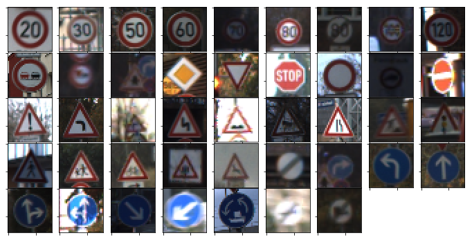
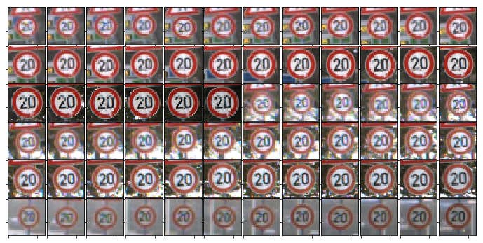
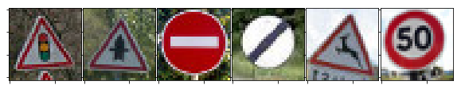

#**Traffic Sign Recognition** 

##Writeup Template

---

**Build a Traffic Sign Recognition Project**

The goals / steps of this project are the following:
* Load the data set (see below for links to the project data set)
* Explore, summarize and visualize the data set
* Design, train and test a model architecture
* Use the model to make predictions on new images
* Analyze the softmax probabilities of the new images
* Summarize the results with a written report

[//]: # (Image References)

[image1]: ./examples/visualization.jpg "Visualization"
[image2]: ./examples/grayscale.jpg "Grayscaling"
[image3]: ./examples/random_noise.jpg "Random Noise"
[image4]: ./examples/placeholder.png "Traffic Sign 1"
[image5]: ./examples/placeholder.png "Traffic Sign 2"
[image6]: ./examples/placeholder.png "Traffic Sign 3"
[image7]: ./examples/placeholder.png "Traffic Sign 4"
[image8]: ./examples/placeholder.png "Traffic Sign 5"

## Rubric Points
###Here I will consider the [rubric points](https://review.udacity.com/#!/rubrics/481/view) individually and describe how I addressed each point in my implementation.  

---
###Writeup / README

####1. Provide a Writeup / README that includes all the rubric points and how you addressed each one. You can submit your writeup as markdown or pdf. You can use this template as a guide for writing the report. The submission includes the project code.

You're reading it! and here is a link to my [project code](https://github.com/RomainSa/CarND-Traffic-Sign-Classifier-Project/blob/master/Traffic_Sign_Classifier.ipynb)

###Data Set Summary & Exploration

####1. Provide a basic summary of the data set and identify where in your code the summary was done. In the code, the analysis should be done using python, numpy and/or pandas methods rather than hardcoding results manually.

The code for this step is contained in the second code cell of the IPython notebook.  

I used the numpy library to calculate summary statistics of the traffic
signs data set:

* The size of training set is 39,209
* The size of test set is 12,630
* The shape of a traffic sign image is (32, 32, 3)
* The number of unique classes/labels in the data set is 4

####2. Include an exploratory visualization of the dataset and identify where the code is in your code file.

The code for this step is contained in cells 3 to 5 of the IPython notebook.  

Let's first visualize one random example for each class:
  
We can see that lighting conditions are varying

We also note that input data is highly correlated:
  
We will have to take this into accound, when splitting the training data into training and validation sets. 

###Design and Test a Model Architecture

####1. Describe how, and identify where in your code, you preprocessed the image data. What tecniques were chosen and why did you choose these techniques? Consider including images showing the output of each preprocessing technique. Pre-processing refers to techniques such as converting to grayscale, normalization, etc.

The code for this step is contained in the fourth code cells 6 to 10 of the IPython notebook.

##### Data augmentation

The first step was to create new images of training data using scaling (zooming in and out between 90% and 110%), rotation (between -15 degrees, up to +15 degrees) and pixel shifting (between -2 and +2 pixels).  
This technique has two advantages:
- first, it fixes the unbalanced training dataset problem
- secondly, it allows the model to learn better

##### Dataset rebalancing (using augmentated data)

We rebalanced the classes to prevent the model from being biaised towards classes that are more present in the training set.  
We chose to have 5000 examples per class. New examples were made using the previously described data augmentation technique.

##### Preprocessing

We converted images to grayscale.  
This has the advantage to reduce the dimension and allows the model to be more invariant to changing lighting conditions.

We also performed a local normalisation (image by image, we substracted the mean pixel value and divided by the standard deviation). This makes the model learn faster, by having a standard range of values for the input data.

####2. Describe how, and identify where in your code, you set up training, validation and testing data. How much data was in each set? Explain what techniques were used to split the data into these sets. (OPTIONAL: As described in the "Stand Out Suggestions" part of the rubric, if you generated additional data for training, describe why you decided to generate additional data, how you generated the data, identify where in your code, and provide example images of the additional data)

The code for splitting the data into training and validation sets is contained in cells 11 to 15 of the IPython notebook.  

In order to divide the training set into a training and validation sets, we must first split it by track.   
A track is a sequence of 30 images that are highly correlated (pictures taken at a few seconds of interval).  
To avoïd having this correlation between the training and validation sets, a track must not be in both the training and validation sets.

First, we calculate the track_id for each class
Then we splits the dataset between train and validation while not splitting tracks.
To finish, we shuffle the data.

####3. Describe, and identify where in your code, what your final model architecture looks like including model type, layers, layer sizes, connectivity, etc.) Consider including a diagram and/or table describing the final model.

The code for my final model is located in the cells 16 to 18 of the ipython notebook. 

The architecture of the model is the following:

| Layer         		|     Description	        					| 
|:---------------------:|:---------------------------------------------:| 
| Input         		| 32x32x1 Grayscale image   							| 
| Convolution 5x5     	| 1x1 stride, same padding, outputs 28x28x6 	|
| RELU					|												|
| Max pooling	      	| 2x2 stride,  outputs 14x14x6 				|
| Convolution 5x5     	| 1x1 stride, same padding, outputs 10x10x16 	|
| RELU					|												|
| Max pooling	      	| 2x2 stride,  outputs 5x5x16 				|
| Fully connected	      	| outputs 120 				|
| DropOut 50%	      	| outputs 120 				|
| Fully connected	      	| outputs 84 				|
| DropOut 50%	      	| outputs 84 				|
| Fully connected	      	| outputs 43 				|

It follows the architecture of the famous model LeNet5.

####4. Describe how, and identify where in your code, you trained your model. The discussion can include the type of optimizer, the batch size, number of epochs and any hyperparameters such as learning rate.

The code for training the model is located in cell 20 the ipython notebook. 

The Adam optimizer was used to train our model. It is an easy-to-use yet powerful optimizer. Batch size was arbitrarily set to 128.
The model was trained for 10 epochs (after 10 epopchs, the model stops to learn and tend to overfit).

####5. Describe the approach taken for finding a solution. Include in the discussion the results on the training, validation and test sets and where in the code these were calculated. Your approach may have been an iterative process, in which case, outline the steps you took to get to the final solution and why you chose those steps. Perhaps your solution involved an already well known implementation or architecture. In this case, discuss why you think the architecture is suitable for the current problem.

The code for calculating the accuracy of the model is located in cell 21 of the Ipython notebook.

My final model results were:
* training set accuracy of 97.4% 
* validation set accuracy of 95.5% 
* test set accuracy of 95.1% 

The model performs reasonnably well, with maybe a slight overfitting.

We used an implementation of LeNet5.
It is a simple model that solved the handwritten digits classification problem, which is close to ours (low-resolution images to be classified in a small number of classes).

###Test a Model on New Images

####1. Choose five German traffic signs found on the web and provide them in the report. For each image, discuss what quality or qualities might be difficult to classify.

Here are six new images for the model to classify.
All seem pretty simple to classify (good lighting conditions)

####2. Discuss the model's predictions on these new traffic signs and compare the results to predicting on the test set. Identify where in your code predictions were made. At a minimum, discuss what the predictions were, the accuracy on these new predictions, and compare the accuracy to the accuracy on the test set (OPTIONAL: Discuss the results in more detail as described in the "Stand Out Suggestions" part of the rubric).

The code for making predictions on my final model is located in cells 22 to 28 of the Ipython notebook.

Here are the results of the prediction:

| Image			        |     Prediction	        					| 
|:---------------------:|:---------------------------------------------:| 
| Traffic signals      		| General caution   									| 
| Right-of-way at the next intersection     			| Right-of-way at the next intersection 										|
| No entry					| No entry											|
| End of all speed and passing limits	      		| End of all speed and passing limits					 				|
| Wild animals crossing			| Wild animals crossing      							|
| Speed limit (50km/h)			| Speed limit (50km/h)      							|

The model got 5 image classes right out of 6, reaching a 83% accuracy.  
The error is predicting 'General caution' instead of 'Traffic signals' on the first image.  
This may be due to using grayscale: the shape of the two traffic sign are quite close when not considering their color.

####3. Describe how certain the model is when predicting on each of the five new images by looking at the softmax probabilities for each prediction and identify where in your code softmax probabilities were outputted. Provide the top 5 softmax probabilities for each image along with the sign type of each probability. (OPTIONAL: as described in the "Stand Out Suggestions" part of the rubric, visualizations can also be provided such as bar charts)

The code for making predictions on my final model is located in cells 30 and 31 of the Ipython notebook.

For the first image, the model is relatively sure that this is a stop sign (probability of 0.69).  
The top 5 predictions are the following:

| Probability         	|     Prediction	        					| 
|:---------------------:|:---------------------------------------------:| 
| .69         			| General caution   									| 
| .27     				| Right-of-way at the next intersection 										|
| .02					| Pedestrians											|
| .02	      			| Traffic signals					 				|
| < .01				    | Double curve      							|

We see that the right answer is in the top 5 result, even thought it has a really low probability.

